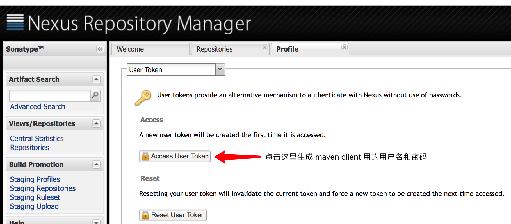

- Code Cache -> https://juejin.im/post/5aebf997f265da0ba76f99db

主要是 JIT 相关的缓存区域

可以通过绑定回调到 MemoryMXBean 对GC情况进行被动收集。
可以通过 ThreadMXBean 知道

当前的各个状态的线程数，
以及死锁 ， 栈情况 ，
cpu 及 user 时间( 可做性能分析 )

主要需求：
  1. 分析虚拟机的内存历史走向
  2. 报警功能
    3. 访问校验
    4. 可视化配置
    5. 栈内情况记录

